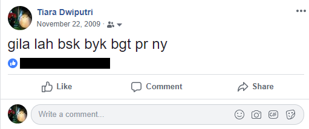
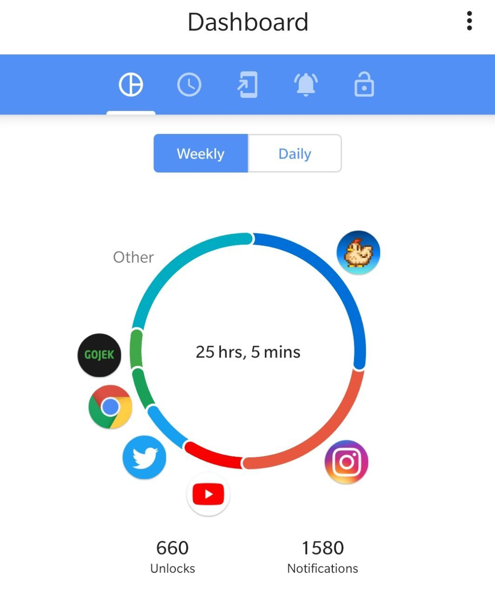

# Lifestyle Changes in Last Decade

## Me 10 years ago...

```{r, echo=FALSE, out.width = '50%'}

```

Facebook is my main source of social digital activities, even so with little to no information regarding my personal details  

People post status, write on each other walls, giving thumbs up and poking people    

## Me today...

```{r, echo=FALSE, out.width = '50%'}

```

## Social Media Takeover

- Your reflexes is to open instagram or at least other social media  
- You have at least 1 active social media to keep you updated with your friends and family  
- You express your mood, hobbies, interest, and association online  

Most of my time spent on Stardew Valley so I'm kinda safe...  
(not really)

# Cyber Security Awareness

## The First Realization

```{r, echo=FALSE, out.width = '80%'}
knitr::include_graphics("assets/safety.png")
```

Going into information security class, my first assignment is to "Find out someone's ATM PIN number"

## Importance of Strong Password  

```{r, echo=FALSE, out.width = '80%'}
knitr::include_graphics("assets/kimmel.png")
```

Head [here](https://www.youtube.com/watch?v=opRMrEfAIiI) for full video

## Frauds and Other Possibilities

- Fraudulent calls  
- Email spams  
- Targeted campaign  
- Identity theft  
- Malware attack  

# The Dangers on Larger Scale

## WannaCry Ransomware

```{r, echo=FALSE, out.width = '80%'}
knitr::include_graphics("assets/wann.png")
```

## Cambridge Analytica Scandal

```{r, echo=FALSE, out.width = '80%'}

```

# Analyzing People Association

## Utilizing Social Media Data

```{r, echo=FALSE, out.width = '70%'}
knitr::include_graphics("assets/example.png")
```

- Utilizing open source R package `rtweet` to access twitter data
- Visualizing people network and association  

## Let's head over to my GitHub for some hands on!

https://github.com/tiaradwiputri/circle-analysis

